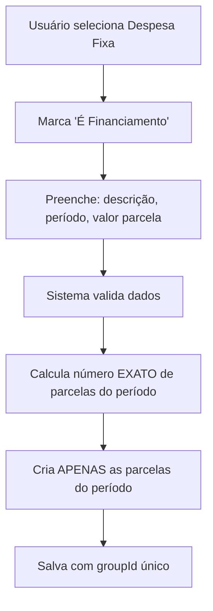
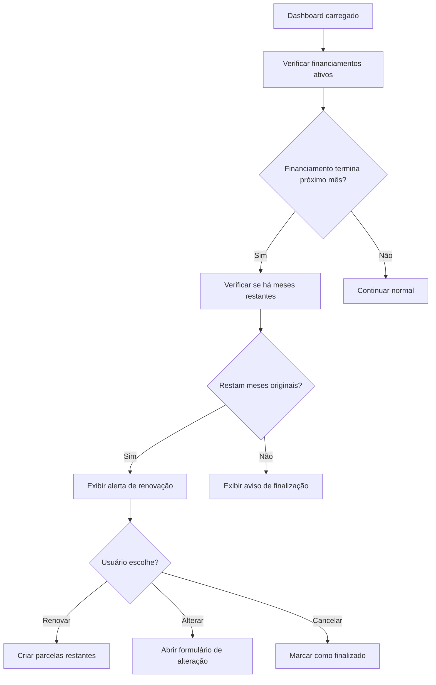
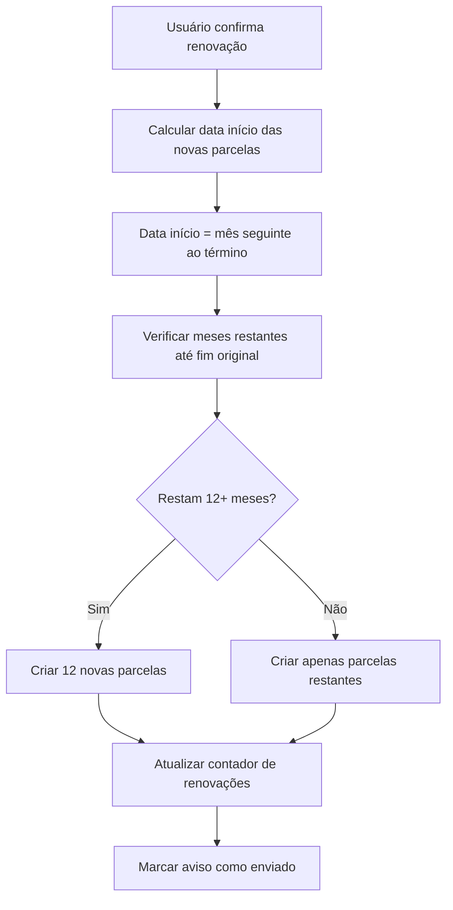

# 💰 Funcionalidade de Financiamento - OrganizaAI

## 📋 Resumo da Feature

Implementar sistema de financiamento para despesas fixas que:
- Permite criar financiamentos com data de início e fim
- Cria parcelas mensais automaticamente (somente durante o período do financiamento)
- Emite aviso 1 mês antes do término para confirmação de renovação
- Gerencia renovações automáticas por mais 12 meses

## 🎯 Objetivos

1. **Criação de Financiamento**: Adicionar opção de financiamento em despesas fixas
2. **Geração Automática**: Criar parcelas mensais APENAS dentro do período do financiamento
3. **Sistema de Avisos**: Notificar usuário 1 mês antes do término para renovação
4. **Renovação Inteligente**: Permitir renovação respeitando o limite original do financiamento

## ⚠️ REGRAS IMPORTANTES DE PARCELAS

### **CRIAÇÃO INICIAL**
O sistema deve criar parcelas **SOMENTE** durante o período do financiamento:
- Se financiamento é de 6 meses → criar 6 parcelas
- Se financiamento é de 3 meses → criar 3 parcelas  
- Se financiamento é de 12 meses → criar 12 parcelas
- **NUNCA** criar 12 parcelas se o financiamento terminar antes

### **RENOVAÇÃO INTELIGENTE**
A renovação deve considerar o tempo restante do financiamento original:
- **Financiamento de 2 anos e meio (30 meses)**:
  - 1ª renovação: adiciona 12 meses (meses 13-24)
  - 2ª renovação: adiciona **APENAS 6 meses** (meses 25-30)
- **Financiamento de 1 ano e meio (18 meses)**:
  - 1ª renovação: adiciona **APENAS 6 meses** (meses 13-18)
- **Financiamento de 3 anos (36 meses)**:
  - 1ª renovação: adiciona 12 meses (meses 13-24)
  - 2ª renovação: adiciona 12 meses (meses 25-36)

## 📊 Análise do Sistema Atual

### Estrutura Existente
- ✅ Sistema de despesas com tipos `fixed` e `variable`
- ✅ Sistema de parcelas (`installments`) já implementado
- ✅ Armazenamento por mês/ano no AsyncStorage
- ✅ EventContext para comunicação entre telas
- ✅ Sistema de alertas com `Alert.alert()`

### Interface Expense Atual
```typescript
interface Expense {
  id: number;
  category: ExpenseCategoryId;
  description: string;
  amount: number;
  type: 'fixed' | 'variable';
  installments?: {
    total: number;
    current: number;
    groupId: string;
  };
}
```

## 🏗️ Estrutura de Implementação

### 1. 📝 Modificações na Interface `Expense`
**Arquivo**: `app/utils/storage.ts`

```typescript
interface Expense {
  // ... campos existentes
  financing?: {
    startMonth: number;
    startYear: number;
    endMonth: number;
    endYear: number;
    originalEndMonth: number; // Data fim ORIGINAL do financiamento
    originalEndYear: number;  // Para saber o limite total
    monthlyAmount: number;
    totalAmount: number;
    isActive: boolean;
    reminderSent?: boolean;
    renewalCount?: number; // Quantas vezes foi renovado
  };
}
```

### 2. 🎨 Modificações no Formulário de Despesas
**Arquivo**: `app/components/ExpenseForm.tsx`

#### Estados Adicionais
```typescript
const [isFinancing, setIsFinancing] = useState(false);
const [financingData, setFinancingData] = useState({
  startMonth: new Date().getMonth(),
  startYear: new Date().getFullYear(),
  endMonth: new Date().getMonth(),
  endYear: new Date().getFullYear(),
  monthlyAmount: 0
});
```

#### Novos Campos no Formulário
- **Toggle "É Financiamento?"** (só aparece quando `type === 'fixed'`)
- **Seletor Mês/Ano de Início**
- **Seletor Mês/Ano de Fim**
- **Campo Valor da Parcela Mensal**
- **Campo Valor Total** (calculado automaticamente)

#### Validações
- Data de fim deve ser posterior à de início
- Valor da parcela deve ser maior que 0
- Período mínimo de 1 mês
- Período máximo configurável (sugestão: 5 anos)

### 3. 🔄 Lógica de Criação de Parcelas
**Arquivo**: `app/expenses/add.tsx`

#### Regras de Negócio CORRIGIDAS
1. **Calcular número exato de parcelas**: Da data início até data fim (inclusive)
2. **Criar parcelas APENAS no período**: Uma para cada mês do financiamento
3. **Não criar parcelas extras**: Se termina em 3 meses, criar apenas 3 parcelas
4. **GroupId único**: Para agrupar todas as parcelas do financiamento

#### Algoritmo de Criação CORRETO
```typescript
const createFinancingInstallments = async (expense: Expense, currentDate: Date) => {
  if (!expense.financing) return;
  
  const { startMonth, startYear, endMonth, endYear, monthlyAmount } = expense.financing;
  const startDate = new Date(startYear, startMonth, 1);
  const endDate = new Date(endYear, endMonth, 1);
  
  // Calcular número total de meses do financiamento
  const totalMonths = calculateMonthsDifference(startDate, endDate) + 1;
  
  let currentInstallmentDate = new Date(startDate);
  let installmentNumber = 1;
  
  // Criar parcelas APENAS até a data fim do financiamento
  while (currentInstallmentDate <= endDate && installmentNumber <= totalMonths) {
    const installmentExpense = {
      ...expense,
      id: Date.now() + installmentNumber,
      amount: monthlyAmount,
      financing: expense.financing,
      installments: {
        total: totalMonths, // Número real de parcelas do financiamento
        current: installmentNumber,
        groupId: expense.financing.groupId || `financing-${Date.now()}`
      }
    };
    
    await StorageService.saveExpenses([installmentExpense], currentInstallmentDate, true);
    
    // Próximo mês
    currentInstallmentDate.setMonth(currentInstallmentDate.getMonth() + 1);
    installmentNumber++;
  }
};

const calculateMonthsDifference = (startDate: Date, endDate: Date): number => {
  const years = endDate.getFullYear() - startDate.getFullYear();
  const months = endDate.getMonth() - startDate.getMonth();
  return years * 12 + months;
};
```

### 4. 🔔 Sistema de Notificação/Aviso
**Arquivo**: `app/utils/FinancingService.ts` (novo)

#### Interfaces e Tipos
```typescript
interface FinancingRenewal {
  expense: Expense;
  monthsUntilEnd: number;
  remainingMonths: number;
}
```

#### Lógica de Aviso CORRIGIDA
```typescript
export class FinancingService {
  // Verificar financiamentos próximos do fim
  static async checkFinancingRenewals(): Promise<FinancingRenewal[]> {
    const currentDate = new Date();
    const currentMonth = currentDate.getMonth();
    const currentYear = currentDate.getFullYear();
    
    // Buscar financiamentos que terminam no PRÓXIMO mês
    const renewals: FinancingRenewal[] = [];
    
    // Verificar financiamentos ativos
    const allExpenses = await this.getAllFinancingExpenses();
    
    for (const expense of allExpenses) {
      if (expense.financing && expense.financing.isActive) {
        const { endMonth, endYear } = expense.financing;
        
        // Se o financiamento termina no próximo mês
        const nextMonth = currentMonth === 11 ? 0 : currentMonth + 1;
        const nextYear = currentMonth === 11 ? currentYear + 1 : currentYear;
        
        if (endMonth === nextMonth && endYear === nextYear && !expense.financing.reminderSent) {
          const remainingMonths = this.calculateRemainingOriginalMonths(expense);
          renewals.push({
            expense,
            monthsUntilEnd: 1,
            remainingMonths
          });
        }
      }
    }
    
    return renewals;
  }
  
  // Mostrar alerta de renovação
  static showRenewalAlert(financing: FinancingRenewal): void {
    const { expense } = financing;
    const remainingMonths = this.calculateRemainingMonths(expense);
    const renewalMonths = Math.min(12, remainingMonths);
    
    Alert.alert(
      'Renovação de Financiamento',
      `Seu financiamento "${expense.description}" termina em 1 mês. ${
        remainingMonths > 0 
          ? `Deseja renová-lo por mais ${renewalMonths} meses?`
          : 'Este financiamento chegou ao fim original.'
      }`,
      [
        { text: 'Cancelar', style: 'cancel' },
        { text: 'Alterar Valor', onPress: () => this.openRenewalForm(financing) },
        ...(remainingMonths > 0 ? [{ text: 'Renovar', onPress: () => this.renewFinancing(financing) }] : [])
      ]
    );
  }
  
  // Renovar financiamento automaticamente
  static async renewFinancing(financing: FinancingRenewal): Promise<boolean> {
    const { expense } = financing;
    if (!expense.financing) return false;
    
    // Calcular nova data de início (mês seguinte ao término)
    const newStartMonth = expense.financing.endMonth === 11 ? 0 : expense.financing.endMonth + 1;
    const newStartYear = expense.financing.endMonth === 11 ? expense.financing.endYear + 1 : expense.financing.endYear;
    
    // Calcular quantos meses faltam até o fim ORIGINAL do financiamento
    const originalEndDate = new Date(expense.financing.originalEndYear, expense.financing.originalEndMonth);
    const renewalStartDate = new Date(newStartYear, newStartMonth);
    const monthsRemaining = this.calculateMonthsDifference(renewalStartDate, originalEndDate) + 1;
    
    // Verificar se ainda há meses para renovar
    if (monthsRemaining <= 0) {
      // Financiamento já chegou ao fim original
      return false;
    }
    
    // Determinar quantos meses adicionar (máximo 12, ou o que resta)
    const monthsToAdd = Math.min(12, monthsRemaining);
    
    // Nova data de fim
    const newEndDate = new Date(newStartYear, newStartMonth);
    newEndDate.setMonth(newEndDate.getMonth() + (monthsToAdd - 1));
    
    // Criar novo financiamento
    const renewedFinancing = {
      ...expense.financing,
      startMonth: newStartMonth,
      startYear: newStartYear,
      endMonth: newEndDate.getMonth(),
      endYear: newEndDate.getFullYear(),
      // Manter originalEndMonth e originalEndYear inalterados
      renewalCount: (expense.financing.renewalCount || 0) + 1,
      reminderSent: false
    };
    
    // Criar nova despesa com o número correto de parcelas
    const renewedExpense = {
      ...expense,
      id: Date.now(),
      financing: renewedFinancing
    };
    
    // Criar as parcelas (pode ser menos de 12)
    await this.createFinancingInstallments(renewedExpense);
    
    return true;
  }
  
  // Calcular meses restantes até o fim original
  static calculateRemainingOriginalMonths(expense: Expense): number {
    if (!expense.financing) return 0;
    
    const currentDate = new Date();
    const originalEndDate = new Date(expense.financing.originalEndYear, expense.financing.originalEndMonth);
    
    return this.calculateMonthsDifference(currentDate, originalEndDate);
  }
  
  // Marcar aviso como enviado
  static async markReminderSent(expense: Expense): Promise<void> {
    if (expense.financing) {
      expense.financing.reminderSent = true;
      // Salvar no storage
      await this.updateFinancingExpense(expense);
    }
  }
}
```

### 5. 🔄 Tela de Renovação de Financiamento
**Arquivo**: `app/financing/renew/[id].tsx` (novo)

#### Funcionalidades
- Mostrar dados atuais do financiamento
- Permitir alterar valor da parcela
- Confirmar renovação por mais 12 meses
- Cancelar financiamento

### 6. 📱 Modificações na Lista de Despesas
**Arquivo**: `app/(tabs)/expenses.tsx`

#### Indicadores Visuais
- **Badge "Financiamento"** para despesas de financiamento
- **Progresso visual**: "Parcela X de Y - Termina em MM/AAAA"
- **Status**: Ativo, Próximo ao Fim, Renovado

#### Exemplo de Display CORRETO
```
🏠 Casa - Financiamento (3 meses)
Parcela 2 de 3 - Termina em Mar/2024
R$ 1.200,00
[Progresso: ████████░░] 67%
```

### 7. 🔍 Verificação Periódica no Dashboard
**Arquivo**: `app/(tabs)/index.tsx`

#### Integração
```typescript
useEffect(() => {
  const checkFinancings = async () => {
    const renewals = await FinancingService.checkFinancingRenewals();
    renewals.forEach(renewal => {
      if (!renewal.expense.financing?.reminderSent) {
        FinancingService.showRenewalAlert(renewal);
        // Marcar como aviso enviado
      }
    });
  };
  
  // Verificar a cada carregamento do dashboard
  checkFinancings();
}, [currentDate]);
```

## 📁 Estrutura de Arquivos

### Arquivos a Modificar
```
📝 MODIFICAÇÕES
├── app/utils/storage.ts              # Interface Expense
├── app/components/ExpenseForm.tsx    # Formulário com financiamento
├── app/expenses/add.tsx              # Lógica de criação
├── app/(tabs)/expenses.tsx           # Visualização
└── app/(tabs)/index.tsx              # Verificação periódica
```

### Arquivos a Criar
```
🆕 NOVOS ARQUIVOS
├── app/utils/FinancingService.ts     # Serviço de gerenciamento
├── app/financing/
│   ├── _layout.tsx                   # Layout das telas de financiamento
│   └── renew/
│       └── [id].tsx                  # Tela de renovação
├── app/components/
│   ├── FinancingForm.tsx             # Formulário específico
│   └── MonthYearPicker.tsx           # Seletor de data
└── __tests__/
    └── financing.test.tsx            # Testes
```

## 🔄 Fluxo de Funcionamento

### 1. Criação de Financiamento


### 2. Sistema de Aviso (1 Mês Antes)


### 3. Renovação Inteligente


## ✅ Tasks de Desenvolvimento

### Sprint 1: Base do Sistema
- [ ] **1.1** Modificar interface `Expense` em `storage.ts`
- [ ] **1.2** Criar `FinancingService.ts` com funções básicas
- [ ] **1.3** Criar componente `MonthYearPicker.tsx`
- [ ] **1.4** Modificar `ExpenseForm.tsx` para incluir campos de financiamento

### Sprint 2: Lógica de Criação
- [ ] **2.1** Implementar função de criação de parcelas CORRETA em `add.tsx`
- [ ] **2.2** Criar validações para dados de financiamento
- [ ] **2.3** Implementar algoritmo de cálculo EXATO de parcelas
- [ ] **2.4** Testar criação de financiamentos com diferentes períodos

### Sprint 3: Sistema de Avisos
- [ ] **3.1** Implementar verificação periódica no dashboard
- [ ] **3.2** Criar sistema de alertas para renovação
- [ ] **3.3** Implementar marcação de "aviso enviado"
- [ ] **3.4** Testar sistema de avisos

### Sprint 4: Renovação e Interface
- [ ] **4.1** Criar tela de renovação `renew/[id].tsx`
- [ ] **4.2** Implementar lógica de renovação automática
- [ ] **4.3** Modificar lista de despesas para mostrar financiamentos
- [ ] **4.4** Adicionar indicadores visuais

### Sprint 5: Testes e Polimento
- [ ] **5.1** Criar testes unitários em `financing.test.tsx`
- [ ] **5.2** Testes de integração
- [ ] **5.3** Testes de usabilidade
- [ ] **5.4** Documentação final

## 🧪 Casos de Teste CORRIGIDOS

### Cenários de Criação
1. **Financiamento de 6 meses**: Deve criar EXATAMENTE 6 parcelas
2. **Financiamento de 12 meses**: Deve criar EXATAMENTE 12 parcelas
3. **Financiamento de 3 meses**: Deve criar EXATAMENTE 3 parcelas
4. **Financiamento de 1 mês**: Deve criar EXATAMENTE 1 parcela
5. **Financiamento com data fim anterior ao início**: Deve mostrar erro

### Cenários de Renovação
1. **Financiamento de 30 meses (2,5 anos)**:
   - 1ª renovação após 12 meses: criar 12 novas parcelas
   - 2ª renovação após 24 meses: criar APENAS 6 parcelas
2. **Financiamento de 18 meses (1,5 anos)**:
   - 1ª renovação após 12 meses: criar APENAS 6 parcelas
3. **Financiamento de 36 meses (3 anos)**:
   - 1ª renovação após 12 meses: criar 12 novas parcelas
   - 2ª renovação após 24 meses: criar 12 novas parcelas
4. **Renovação com alteração de valor**: Deve permitir modificar valor
5. **Cancelamento**: Deve finalizar sem criar novas parcelas
6. **Múltiplas renovações**: Deve manter histórico e respeitar limite original

### Cenários de Edge Cases
1. **Mudança de ano**: Financiamento que cruza anos
2. **Meses com diferentes dias**: Fevereiro, meses com 30/31 dias
3. **Financiamentos simultâneos**: Múltiplos financiamentos ativos
4. **Exclusão de parcelas**: Como tratar exclusão manual de parcelas
5. **Renovação após fim original**: Financiamento que já chegou ao limite
6. **Financiamentos muito longos**: 5+ anos com múltiplas renovações
7. **Alteração de valor durante renovação**: Impacto nas parcelas futuras
8. **Cancelamento de financiamento**: Limpeza de parcelas futuras

## 📈 Métricas de Sucesso

- ✅ **Funcionalidade**: 100% dos financiamentos criam o número CORRETO de parcelas
- ✅ **Avisos**: 100% dos financiamentos no penúltimo mês recebem alerta
- ✅ **Renovação**: 100% das renovações criam o número CORRETO de parcelas (máx 12, mín restantes)
- ✅ **Performance**: Criação de parcelas em < 2 segundos
- ✅ **UX**: Interface intuitiva e clara para o usuário

## ⚠️ Limitações e Considerações

### Limitações do Sistema
1. **Renovações**: Limitadas ao período original do financiamento
2. **Valor das parcelas**: Fixo durante cada período de 12 meses
3. **Exclusão manual**: Pode quebrar a lógica de renovação automática
4. **Múltiplos financiamentos**: Cada um funciona independentemente

### Regras de Negócio Importantes
1. **Data original é imutável**: Uma vez definida, não pode ser alterada
2. **Renovação inteligente**: Nunca ultrapassa o prazo original
3. **Avisos únicos**: Cada período recebe apenas um aviso
4. **Cancelamento**: Remove parcelas futuras não pagas

## 🚀 Considerações Técnicas

### Performance
- Otimizar criação em lote de parcelas
- Cache de verificações de renovação
- Lazy loading para dados de financiamento
- Índices para consultas por `groupId`

### Segurança
- Validação rigorosa de dados de entrada
- Sanitização de inputs de data/valor
- Backup antes de operações críticas
- Logs de auditoria para renovações

### Manutenibilidade
- Código bem documentado com exemplos
- Testes abrangentes para todos os cenários
- Logs detalhados para debug
- Estrutura modular e extensível
- Versionamento da estrutura de dados

---

**Status**: 📋 Em Planejamento  
**Prioridade**: 🔥 Alta  
**Estimativa**: 4-5 Sprints  
**Responsável**: Equipe de Desenvolvimento 